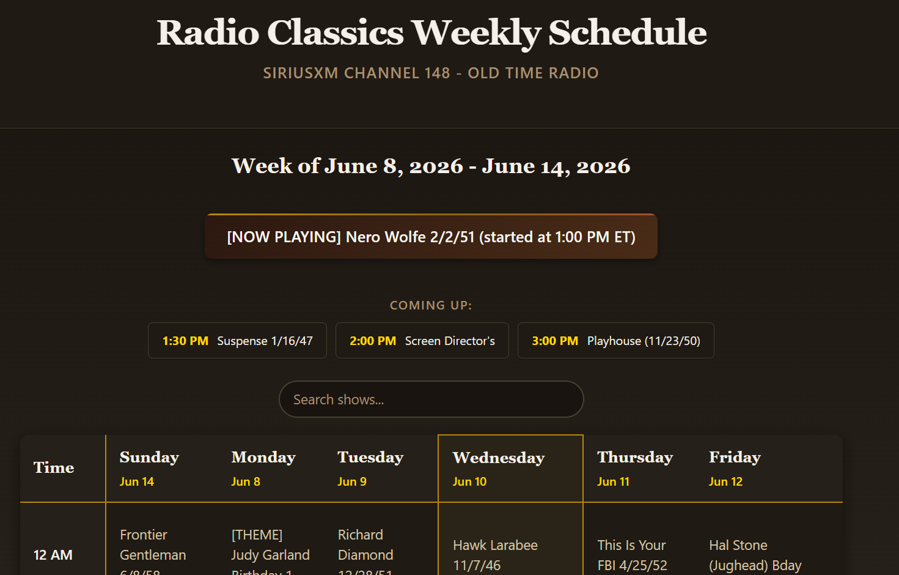

# Radio Classics Schedule

An accessible weekly schedule for **SiriusXM Radio Classics (Channel 148)** - the
old-time radio station playing Golden Age programs like *Suspense*, *Gunsmoke*,
*The Six Shooter*, and *Lux Radio Theatre*.

**Live site:** https://duvey03.github.io/radio-classics/



The official schedule is only published as a weekly Excel file, which is awkward to
read on a phone. This project automatically scrapes that file, converts it to a clean
JSON feed, and renders it as a fast, searchable, mobile-friendly web page that updates
itself with no manual work.

## Why I built this

My grandpa loves this channel, but he had no easy way to see what's on. He doesn't own
a computer - just a cell phone - and isn't comfortable navigating the internet. So I
built him a single, dead-simple page with large, readable text, saved it to his phone's
home screen as an "app," and made it update itself so neither of us ever has to touch
it. He taps one icon and instantly sees what's playing now and what's coming up.

That's also why the page leans hard on accessibility - big text, high contrast,
semantic markup, and screen-reader support - so it stays usable for anyone who finds
the schedule as hard to read as he did.

## Features

- **Always current** - a GitHub Action re-fetches the schedule on a cron and commits
  the updated data, so the site stays fresh on its own.
- **"What's on now" and "Coming up"** - highlights the current show based on Eastern
  Time, regardless of the visitor's timezone.
- **Search** - filter the whole week by show name.
- **Accessible** - semantic table markup, ARIA live regions, a skip link, keyboard
  support, and screen-reader-friendly labels.
- **No build step, no framework** - plain HTML/CSS/JS served straight from GitHub Pages.

## How it works

```
gregbellmedia.com (weekly .xlsx)
        │
        ▼
scripts/fetch_schedule.py   ──►  docs/schedule.json
        │                              │
   GitHub Actions                      ▼
   (cron + commit)            docs/index.html + app.js + style.css
                                       │
                                       ▼
                              GitHub Pages (live site)
```

1. **`scripts/fetch_schedule.py`** downloads the source page, finds the Excel file for
   the current week (parsing the date range out of each filename), and downloads it.
2. It parses the spreadsheet dynamically - locating the header row by day names, the
   Eastern Time column, and the time blocks - then joins multi-line show descriptions,
   tags themed programming, estimates show durations, and writes `docs/schedule.json`.
   If anything fails, it writes a safe placeholder so the site never breaks.
3. **`.github/workflows/update-schedule.yml`** runs the script on a schedule, and
   commits `docs/schedule.json` only when it changes.
4. The static frontend in **`docs/`** fetches that JSON and renders the table.

## Project structure

```
.
├── docs/                       # The published site (GitHub Pages serves this folder)
│   ├── index.html
│   ├── app.js                  # Rendering, search, "what's on now" logic
│   ├── style.css
│   └── schedule.json           # Generated data (auto-committed by CI)
├── scripts/
│   └── fetch_schedule.py       # Scraper + Excel parser
├── .github/workflows/
│   └── update-schedule.yml     # Scheduled fetch-and-commit job
└── requirements.txt
```

## Running the fetcher locally

Requires Python 3.12+.

```bash
python -m venv venv
venv/Scripts/python.exe -m pip install -r requirements.txt   # Windows
# or:  ./venv/bin/python -m pip install -r requirements.txt   # macOS/Linux

venv/Scripts/python.exe scripts/fetch_schedule.py
```

This regenerates `docs/schedule.json`. To preview the site, serve the `docs/` folder:

```bash
python -m http.server -d docs 8000
# then open http://localhost:8000
```

## Deployment

The site is hosted on GitHub Pages from the `docs/` folder on the `main` branch. The
schedule data refreshes automatically via the GitHub Action - no manual deploys needed.

## Acknowledgements

Schedule data comes from [gregbellmedia.com](https://gregbellmedia.com/). This project
is an unofficial, fan-made viewer and is not affiliated with SiriusXM or Radio Classics.

## License

[MIT](LICENSE)
